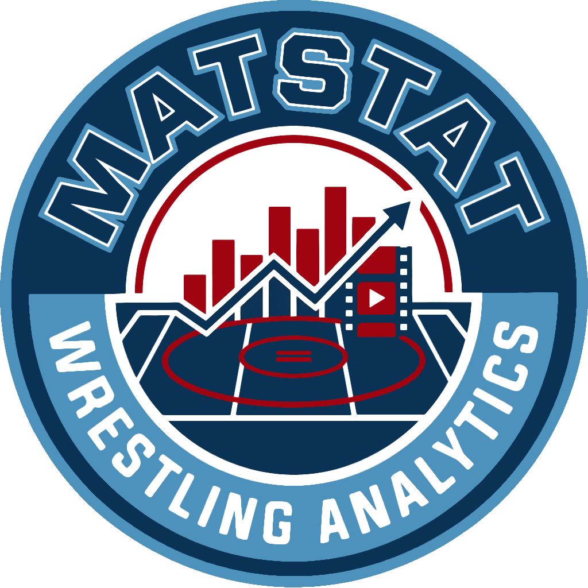

<p align="center">
    
    </img>
</p>

A tool for statistical analysis and move and position specific film generation of folkstyle wrestling film.

MatStat provides a Qt6 graphical interface and a FastAPI web app to tag wrestling matches, extract sequence data, generate statistical reports, and create move and position specific film. It embeds chapter metadata into video files to create a data source for analyzing wrestler performance, move effectiveness, and match dynamics.

## Key Features

-   Two interfaces: **Qt6 GUI** (`python scripts/qt_app/main.py`) and **web app** (`uvicorn scripts.web.app:app --reload`).
-   Interactive tagging of sequences with ties/positions, moves, and scoring — each move can be assigned a count for how many times it occurred in a sequence.
-   Embeds chapter data directly into new Matroska (`.mkv`) video files.
-   Compiles data from multiple tagged videos into wrestler-specific CSV files.
-   Generates reports on offense, defense, and attack initiation.
-   Exports statistics into a multi-sheet Excel workbook.
-   Generates move and position specific film by combining clips based on wrestler, tie-ups, or moves, with optional fast stream-copy extraction and batch multi-wrestler processing.
-   Preview your generated highlight reel directly in the GUI before saving.
-   Cross-wrestler search with filterable queries and video preview.
-   Configuration is done by editing text files for wrestlers, moves, and scoring outcomes, editable via a built-in Settings dialog (File > Settings).

## Data Pipeline

The data pipelines are as follows:

1.  **Tagging (`Tag Film` tab):** A user selects a raw video from `vids/untaged/`. The interface guides the user through creating chapters for each action sequence. A new, tagged `.mkv` video is created in `vids/taged/`, and the original is hidden.
2.  **Compilation (`Compile Stats` tab):** Processes all tagged videos in `vids/taged/`. It extracts the chapter data and aggregates it, writing one `.csv` file per wrestler into `stats/wrestler_data/`.
3.  **Data Use:**
    - **Analysis (`Team Evaluation` tab):** Reads the per-wrestler CSV files, loads them into pandas DataFrames, and calculates a variety of statistics. These stats are then added to wrestler-specific sheets of the `stats/reports/Team_Stats.xlsx` Excel file.
    - **Viewing (`Combine Clips` tab):** Lets you filter tagged sequences by wrestler, tie-up, or move, then concatenates matching clips into a single video in `vids/clips/`. The GUI provides a live preview of the generated reel.
    - **Search (`Search` tab):** Query across all wrestlers' tagged data with filters for tie-up, moves, scores, and net points. Preview results in the video player and export to CSV.

## Directory Structure

-   `cfg/`: Contains configuration files for wrestlers, moves, ties, etc. Edit these to customize the tagging options.
-   `vids/`:
    -   `untaged/`: Location for raw video files to be tagged.
    -   `taged/`: Output location for `.mkv` video files with embedded chapter metadata.
    -   `clips/`: Output location for generated highlight reel videos.
-   `stats/`:
    -   `wrestler_data/`: Contains intermediate `.csv` files for each wrestler.
    -   `reports/`: Contains the final `Team_Stats.xlsx` report.
-   `scripts/`: Contains the application logic scripts.
    -   `qt_app/`: Qt6 GUI application (main.py, main_window.py, widgets, workers).
    -   `web/`: FastAPI web app (app.py, jobs, ffmpeg runner, tab modules, static/).
    -   `helpers.py`: Shared data classes and utility functions.
-   `shell.nix`: Nix development shell (all dependencies pre-configured).
-   `Pipfile`: pipenv dependencies (alternative to nix-shell).
-   `MatStat.log`: A log file for debugging and tracking application activity.

## Installation and Setup

### Dependencies

-   `pipenv`
-   `ffmpeg`
    -   `ffprobe` (included with most ffmpeg packages)

### Setup

#### NixOS (primary development environment)

On NixOS, use `nix-shell` to enter a development shell with all dependencies (Python, PyQt6, ffmpeg, pytest):

```bash
git clone https://github.com/MDKattner/MatStat.git
cd MatStat
nix-shell
```

Once inside `nix-shell`:
```bash
python scripts/qt_app/main.py             # Launch Qt6 GUI
uvicorn scripts.web.app:app --reload      # Launch web app (http://127.0.0.1:8000)
pytest                                    # Run tests
```

#### Non-NixOS (pipenv)

Install [ffmpeg and ffprobe](https://ffmpeg.org/download.html). Install [pipenv](https://pipenv.pypa.io/en/latest/installation.html).

```bash
git clone https://github.com/MDKattner/MatStat.git
cd MatStat
pipenv install PyQt6 PyQt6-QtMultimedia
pipenv install
```

To run:
```bash
pipenv run python scripts/qt_app/main.py             # Launch Qt6 GUI
pipenv run uvicorn scripts.web.app:app --reload      # Launch web app (http://127.0.0.1:8000)
pipenv run pytest                                    # Run tests
```

## Usage

**Qt6 GUI:** Run the graphical interface:
```bash
python scripts/qt_app/main.py
```
This launches a multi-tab window with all five tools accessible at once. The log panel at the bottom is hidden by default; pass `--visible-logging` to show it:
```bash
python scripts/qt_app/main.py --visible-logging
```
Each tab has its own workflow:
- **Tag Film**: Select a video, tag sequences with time ranges, ties, moves (with per-move count), and scoring. Preview the video while tagging.
- **Compile Stats**: Process all tagged videos to generate per-wrestler CSV files.
- **Team Evaluation**: Select a wrestler and view offensive/defensive statistics, then generate an Excel report.
- **Combine Clips**: Filter tagged sequences by wrestler, tie-up, or move. Check multiple wrestlers for batch processing. Enable "Fast extraction (stream copy)" for up to 5x faster clip generation when source codecs are compatible. Preview matching clips and generate a highlight reel.
- **Search**: Query across all wrestlers' tagged data with filters for tie-up, moves, scores, and net points. Preview results in the video player and export to CSV.

**Web app:** Start the FastAPI server and open http://127.0.0.1:8000 in a browser:
```bash
uvicorn scripts.web.app:app --reload
```
The five tabs above are available in the browser with the same workflows. Browsers can't play `.mkv` directly, so sources are transcoded to cached MP4 previews on demand.

## Module Overview

-   **`helpers.py`**: Contains shared data classes (`ChapterSequence`) and functions used by the GUI and web app for video processing, data formatting, and statistical calculation. Also contains many useful functions for analyzing the csv files in a Jupyter Notebook.
-   **`scripts/qt_app/`**: The Qt6 GUI (main.py, main_window.py, widgets, workers).
-   **`scripts/web/`**: The FastAPI web app (app.py, ffmpeg.py, jobs.py, ws.py, transcode.py, and the tab modules tag/stats/team_eval/clips/search).

## Configuration

Customize the tagging options by editing the text files in the `cfg/` directory:

-   `Wrestlers.config`: Add wrestler names with each wrestler on a new line. DO NOT COMMIT PID IN THIS FILE.
    - To avoid this run ```git update-index --assume-unchanged cfg/Wrestlers.config``` after cloning the repo
-   `Ties.config`: Add tie-ups or positions (e.g., "overhook", "leg ride", "in base").
-   `Moves.config`: Add move names.
-   `Outcomes.config`: Add scoring notations (e.g., "T" for Takedown, "N3" for Nearfall-3pts).
    - Alternatively, use File → Settings (Ctrl+,) in the Qt6 GUI for a structured editor with Add, Edit, and Delete support and automatic backup creation.
